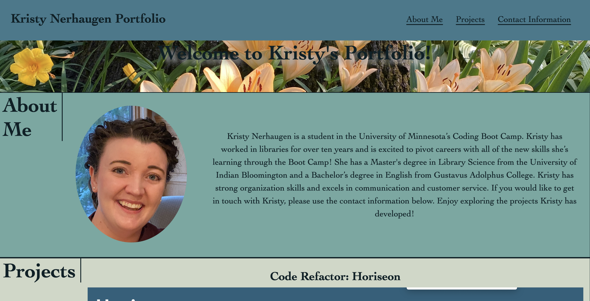
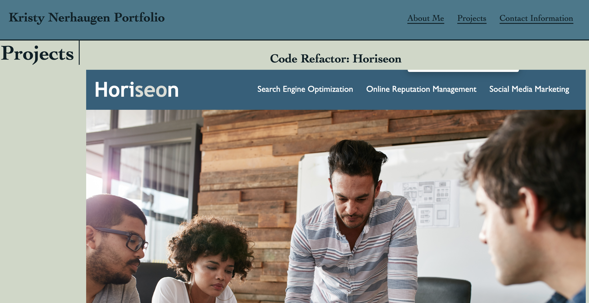
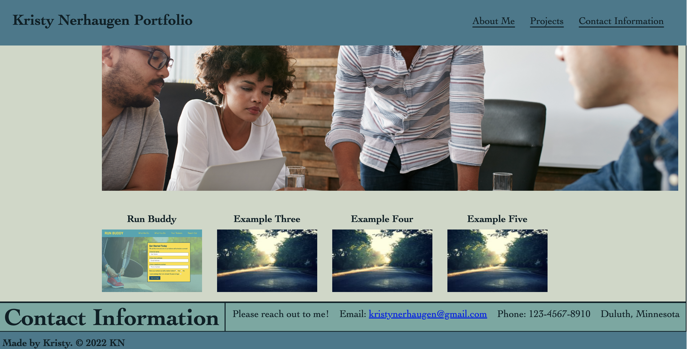

# Challenge Two: Kristy Nerhaugen Portfolio

## For this challenge, I created a portfolio. The goal of this portfolio is to have a way to display my professional work to potential employers. I hope to continue to expand this portfolio and improve the site as I learn more in the BootCamp. This portfolio includes a short write-up about myself and a photograph. I also have a section highlighting the projects I've worked on. It includes linking images to the Code Refactor project and Run Buddy project. It also includes three example project place holders for when I expand my portfolio. I included contact information (not my real phone number) at the bottom of the website. The website has a top navigation bar with links to each section of the site. The site is also mobile responsive so that it can adjust for common screen sizes.

### This link will take you to my deployed portfolio:

[See deployed site here](https://kristynerhaugen.github.io/KristyNerhaugen_Portfolio/)

## Installation

### Access the code via GitHub. Install how you would usually install from a GitHub repository.

## Usage

### The website is to be used to access the project I've worked on. The five images can be clicked on to get access to deployed projects. For now, only two of the images link to deployed sites, but that will be updated as I expand my portfolio.

### These three images show the site:

#### 

#### 

#### 

## Credits

### This site was created using what I learned in the BootCamp Spot modules and information I learned in BootCamp classes. I occasionally referred to the code used in the modules for the Run Buddy project to help guide my code for this portfolio. I also referred to W3 Schools (https://www.w3schools.com/) and MDN (https://developer.mozilla.org/en-US/) at times. This Flex website also helped me to better understand Flex when I set up the site: https://flexbox.malven.co/. The placeholder image used for Example Five is provided for free from Lorem Picsum (https://picsum.photos/). I used Coolors (https://coolors.co/000505-3b3355-5d5d81-bfcde0-fefcfd) to determine a color palette.

## License

### Copyright 2022 Kristy Nerhaugen
