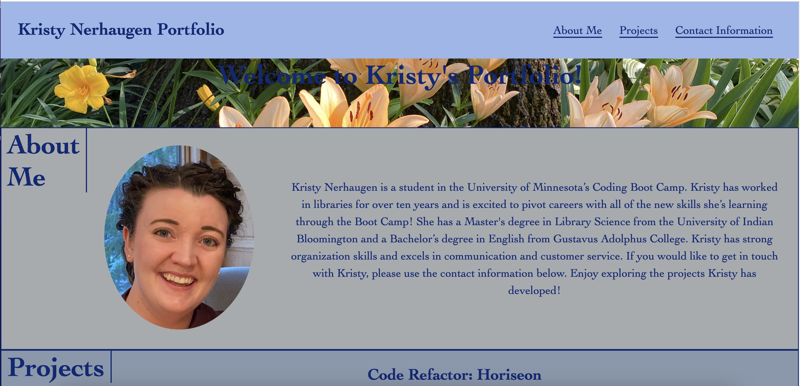
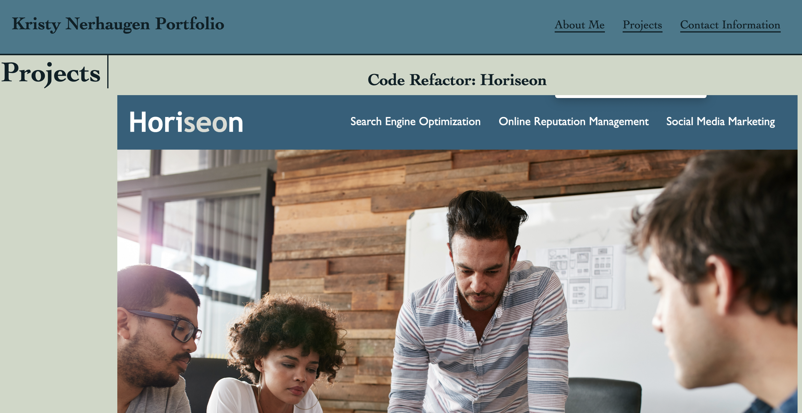
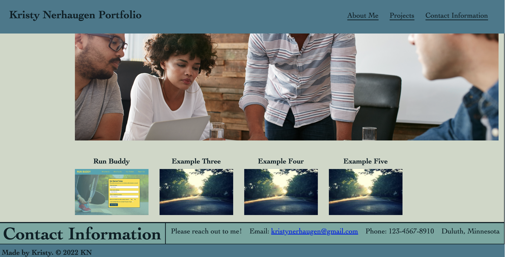

# Challenge Two: Kristy Nerhaugen Portfolio

## For this challenge,  

### This link will take you to my deployed portfolio:

[See deployed site here](https://kristynerhaugen.github.io/KristyNerhaugen_Portfolio/)

### These three images show the site. 
ADD SCREENSHOTS HERE
#### 
#### 
#### 

## Installation
### Access the code via GitHub. Install how you would usually install from a GitHub repository. 

## Usage
### 

## Credits
###  

## License 
### n/a 